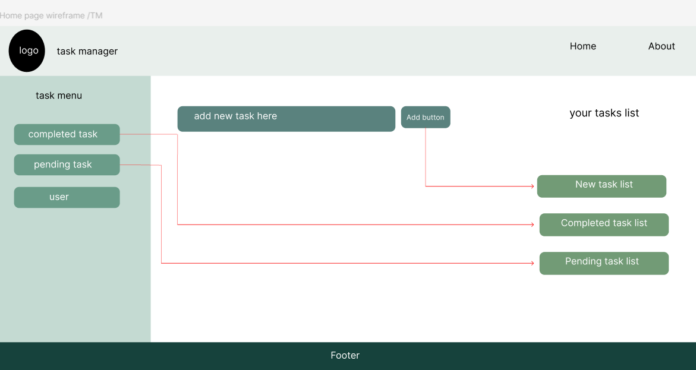
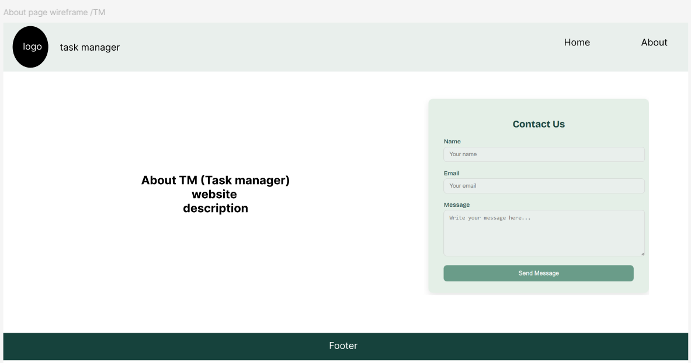

# 📝 Task Manager Website

**Task Manager (TM)** is a simple and user-friendly web application that allows you to **add**, **edit**, and **delete** tasks with ease.  
Designed with a clean and intuitive interface, TM helps you stay productive and organized.

---

## 🖼️ Wireframes

Below are the wireframes for the main pages of the website:

- **Home Page Wireframe**   
------------------------------------------------

- **About Page Wireframe** 

---

## ❓ Questions & Reflections

While working on this project, I encountered a few questions that I would appreciate guidance on:

1. **JavaScript Organization**  
   How can I properly implement JavaScript code that relates to the "About" page within the `app.js` file?

2. **Time Management**  
   What’s the best way to manage time and tasks effectively during lab-based or solo web development projects?

3. **Static Elements**  
   Is it acceptable to include non-functional, static elements in a project purely for visual or structural enhancement?

---

## ⏱️ Estimated Time & Actual Duration

Initially, based on the project instructions, I estimated that it would take **about one day** to complete.

However, my actual workflow involved:

- Refreshing knowledge of **HTML**, **CSS**, and **JavaScript**
- Reviewing the **DOM (Document Object Model)**
- Designing and building the final layout
- Implementing core functionality

This process took approximately **two and a half days**, as I wanted to ensure a thorough understanding and thoughtful execution of each step.

---

